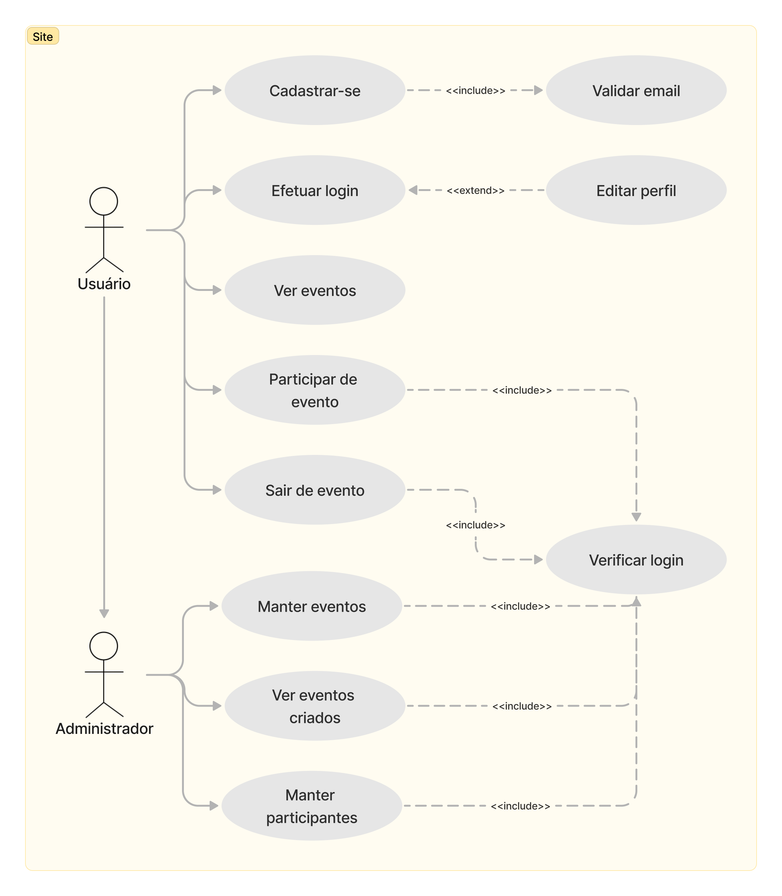
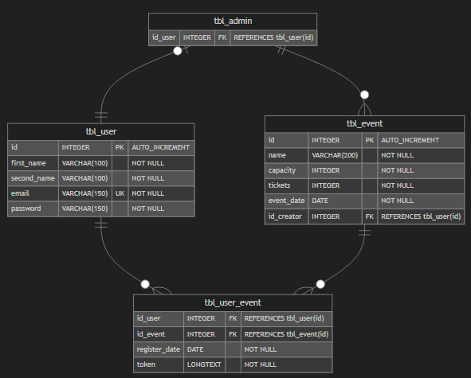
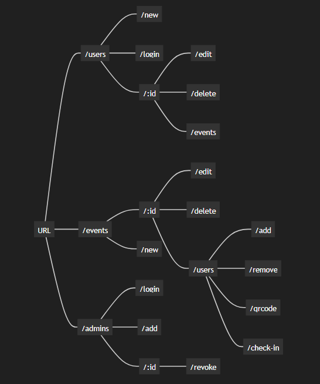

## Resumo do projeto
Na faculdade, tive que deselvolver um sistema de controle de eventos simples, mas posteriormente, decidi recriar a mesma ideia do projeto, de uma maneira mais funcinal, e utilizando a biblioteca Express do NodeJS junto com o Typescript para fazer uma API REST.

### Casos de Uso
Antes de começar a desenvolver, planejei como seria o sistema, e suas funcionalidades. Para representar isso, fiz um diagrama de caso de Uso que mostra como o usuário poderia interagir com a API atraves de um site.

### Banco de dados
Os Usuários podem se cadastrar e participar dos eventos
Administradores devem possuir um cadastro de usuário, para então receber uma conta de Admnistrador que deve ser cadastrada por um Gerente fora da aplicação.
Os eventos são criados apenas por Administradores.

### Rotas
Todas as rotas do sistema partem da URL base, e são divididas entre Usuários, Eventos, e Administradores.

